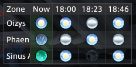

## WeatherWane

A lightweight FFXIV weather forecast plugin. Choose which zones to track, and see upcoming weather at a glance.

**Author:** Le Vagabond

## Features

- Compact weather forecast widget for any zone with dynamic weather
- Toggle visibility from the ☁ icon in the server info bar
- Shift-click the ☁ icon to open settings
- Configurable number of forecast periods (3–16)
- Auto-resize, lock position, transparent background options
- Auto-refreshes when weather changes (~23 minutes)

## Installation

- Download the DLL and manifest JSON from [Releases](https://github.com/Le-Vagabond-gh/ffxiv_weatherwane/releases) in the same location
- Open the Dalamud Plugin Installer
- Go to Settings
- Head to the "Experimental" tab
- Under "Dev Plugin Locations", click "Select dev plugin DLL"
- Add the DLL you downloaded
- Press "Save and Close"
- in the main plugin installer window, enable the plugin in Dev Tools

note: adding custom repositories to Dalamud is a security risk, this way protects you from malicious updates from untrusted sources

## Usage

- `/ww` or `/weatherwane` — Toggle the weather forecast window
- `/ww config` — Open the configuration window to select zones
- Click the ☁ in the server info bar to toggle the window
- Shift-click the ☁ to open settings
